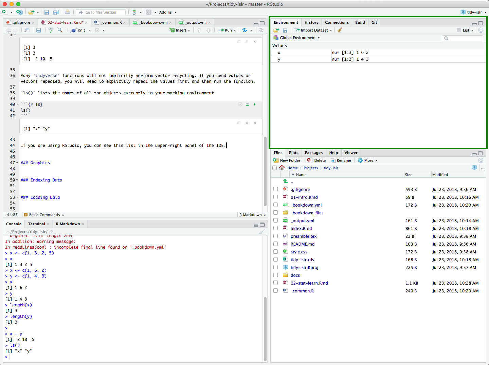

# What Is Statistical Learning? {#stat-learn}

## What Is Statistical Learning?


## Assessing Model Accuracy


## Lab: Introduction to R

### Basic Commands


```r
x <- c(1, 3, 2, 5)
x
```

```
## [1] 1 3 2 5
```

Use the assignment operator `<-` to create new objects in R. Objects can be replaced (or overridden) by creating a new object with the same name.


```r
x <- c(1, 6, 2)
y <- c(1, 4, 3)
x
```

```
## [1] 1 6 2
```

```r
y
```

```
## [1] 1 4 3
```

R performs simple mathematical calculations. For instance, to add numbers use the `+` notation. This will add the first value of `x` to the first  value of `y`, and so on. R uses vector recycling if you try to combine vectors that are not the same length, so use `length()` to confirm that `x` and `y` contain the same number of values.


```r
length(x)
```

```
## [1] 3
```

```r
length(y)
```

```
## [1] 3
```

```r
x + y
```

```
## [1]  2 10  5
```

Many tidyverse functions will not implicitly perform vector recycling. If you need values or vectors repeated, you will need to explicitly repeat the values first and then run the function.

`ls()` lists the names of all the objects currently in your working environment.


```r
ls()
```

```
## [1] "x" "y"
```

If you are using RStudio, you can see this list in the upper-right panel of the IDE:



Most tidyverse functions assume your data is stored in a **data frame**. A data frame is a spreadsheet style data object which stores values in columns and rows. A [**tidy data frame**](http://r4ds.had.co.nz/tidy-data.html) adheres to three basic principles:

1. Each variable must have its own column
1. Each observation must have its own row
1. Each value must have its own cell

**Tibbles** are a special type of data frame which work nicely with tidyverse packages and RStudio. To create a tibble, we first need to load the `tibble` package. Packages in R contain additional functions which build new features onto the base R software. Packages are loaded using the `library()` function, at which point all the functions in the library are now directly accessible.


```r
library(tibble)
```

To create a tibble, we use the `tibble()` function:


```r
tibble(
  x = 1:5,
  y = 1,
  z = x ^ 2 + y
)
```

```
## # A tibble: 5 x 3
##       x     y     z
##   <int> <dbl> <dbl>
## 1     1     1     2
## 2     2     1     5
## 3     3     1    10
## 4     4     1    17
## 5     5     1    26
```

Each column of a tibble is defined as a vector, and columns can be created either by individual vectors or by recycling inputs of length 1. You can also create variables that are derived from already created columns (hence `z`).

### Graphics

[`ggplot2`](https://ggplot2.tidyverse.org/) is the tidyverse preferred package for generating graphics in R. It is structured on the [layered grammar of graphics](https://www.tandfonline.com/doi/abs/10.1198/jcgs.2009.07098) and provides a consistent syntax for creating both basic and advanced statistical graphs.

> See the [data visualization cheat sheet](https://github.com/rstudio/cheatsheets/raw/master/data-visualization-2.1.pdf) for a summary of the core graphing functions in `ggplot2`.

For instance, to create a basic scatterplot:


```r
# create simulated data
scatter_data <- tibble(
  x = rnorm(100),
  y = rnorm(100)
)

library(ggplot2)    # load ggplot2

# generate scatterplot
ggplot(data = scatter_data, aes(x = x, y = y)) +
  geom_point()
```


`ggplot2` builds graphs in layers, so additional components are added using the `+` notation. To add labels to this graph, use the `labs()` function.


```r
ggplot(data = scatter_data, aes(x = x, y = y)) +
  geom_point() +
  labs(title = "This is a plot of X vs Y",
       x = "This is the x-axis",
       y = "This is the y-axis")
```


To export `ggplot()` objects, use `ggsave()`:

```r
x <- ggplot(data = scatter_data, aes(x = x, y = y)) +
  geom_point() +
  labs(title = "This is a plot of X vs Y",
       x = "This is the x-axis",
       y = "This is the y-axis")

ggsave(filename = "scatterplot.pdf", plot = x)
```

`ggplot2` is an excellent package for creating static two-dimensional graphs. For interactive or three-dimensional graphs, consider [plot.ly](https://plot.ly/r/) or [`highcharter`](http://jkunst.com/highcharter/).

### Indexing Data


### Loading Data


### Additional Graphical and Numerical Summaries
